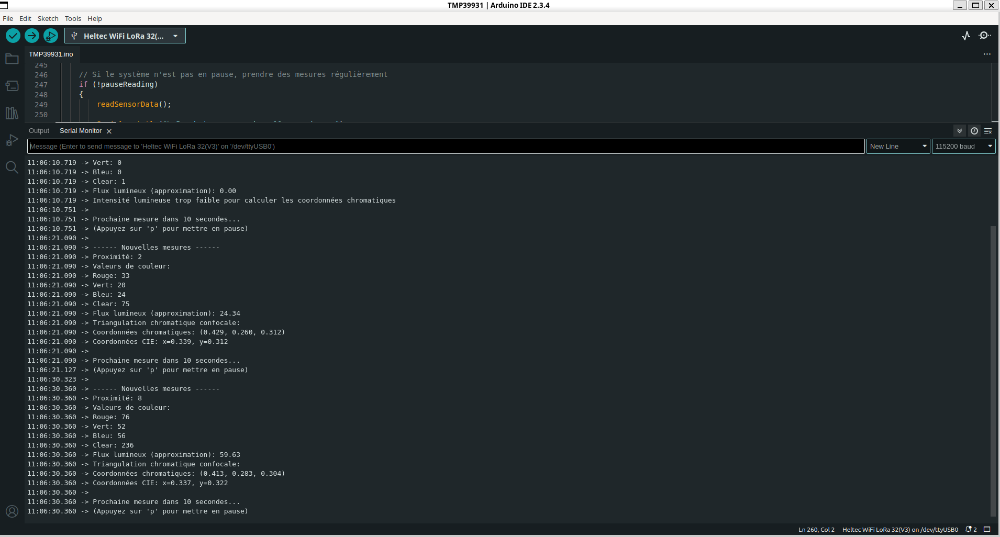

# 💡 2-Light_Gest_Col_Prox – Capteur TMG39931 (Heltec WiFi LoRa 32 V3)

Ce projet Arduino permet de lire et afficher en temps réel les **valeurs de proximité**, **couleurs RVB**, et des données **chromatiques** depuis le capteur **TMG39931**, en communication directe via le bus I2C.

Aucun pilote externe n’est utilisé : **seule la bibliothèque `Wire.h`** est nécessaire, pour une gestion fine des registres.

---

## 📷 Capture d’écran du Moniteur Série

---

## 🔧 Matériel utilisé

- **Carte** : Heltec WiFi LoRa 32 (V3)
- **Capteur** : AMS TMG39931
- **Communication** : I2C

| Signal I2C | Pin Heltec utilisée | GPIO |
|------------|---------------------|------|
| SDA        | J3 Pin 8            | 41   |
| SCL        | J3 Pin 7            | 42   |

---

## 🧰 Bibliothèque utilisée

| Bibliothèque | Rôle                                                                 |
|--------------|----------------------------------------------------------------------|
| `Wire.h`     | Gère la communication I2C entre la carte Heltec et le capteur TMG39931 |

---

## 🧠 Ce que fait le code

- Initialise le capteur TMG39931 via des **écritures manuelles dans les registres I2C**
- Lit toutes les 10 secondes :
  - **Proximité**
  - **Rouge, Vert, Bleu, Clear**
  - **Flux lumineux approximatif**
  - **Coordonnées chromatiques normalisées**
  - **Coordonnées CIE x/y**
- Possibilité de **mettre en pause les mesures** (`p`), de faire une **mesure unique** (`n`) ou de **redémarrer** (`r`)

---

## 🧩 Description des registres manipulés

Le code communique directement avec les registres internes du capteur via I2C.

| Registre         | Adresse | Utilité                                 |
|------------------|---------|------------------------------------------|
| `ID`             | 0x92    | Vérifie l'identité du capteur (doit valoir 0xAB) |
| `ENABLE`         | 0x80    | Active/désactive le capteur              |
| `ATIME`          | 0x81    | Temps d’intégration du capteur couleur   |
| `PERS`           | 0x8C    | Persistance d’interruption               |
| `CONTROL`        | 0x8F    | Contrôle du gain                         |
| `PDATA`          | 0x9C    | Donnée brute de proximité                |
| `CDATAL/H`, etc. | 0x94+   | Données de couleur 16 bits (Clear, R, G, B) |

---

## 🔍 Fonctions principales du code

| Fonction                  | Rôle |
|---------------------------|------|
| `writeRegister()`         | Écrit une valeur dans un registre du capteur via I2C |
| `readRegister()`          | Lit une valeur d’un registre via I2C |
| `initializeTMG39931()`    | Configure le capteur pour l’acquisition (activation, gain, timing) |
| `readSensorData()`        | Récupère les données de capteurs, les affiche et effectue des calculs chromatiques |
| `loop()` / `setup()`      | Gèrent le démarrage, la pause, les commandes clavier et la prise périodique de mesure |

---

## 🎨 Traitement des données couleurs

- **Flux lumineux** : calculé via une pondération RVB type luminance vidéo :  
  `0.299 * R + 0.587 * G + 0.114 * B`

- **Coordonnées chromatiques (r, g, b)** :  
  Normalisation des valeurs RGB pour obtenir leur proportion.

- **Conversion CIE (x, y)** :  
  Utilise une approximation XYZ simplifiée pour représenter la position chromatique sur le plan CIE 1931.

---

## ⌨️ Commandes disponibles (via Serial Monitor)

- `p` – Pause ou reprise automatique des mesures
- `n` – Mesure manuelle (en pause uniquement)
- `r` – Redémarre le système

---

## 📁 Fichiers

- [`TMG39931.ino`](./TMP39931.ino) – Le code complet du projet
- [`TMG39931.png`](./TMP39931.png) – Capture du moniteur série

---
