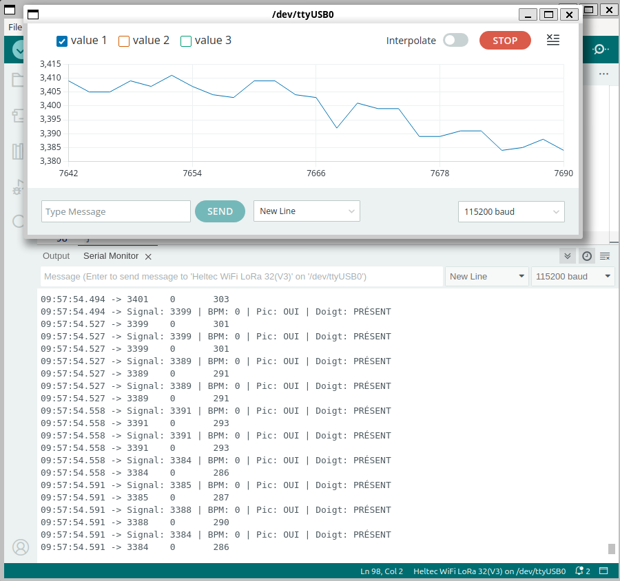

# ❤️ 3-HeartBeat_Sensor – Iduino Capteur de Pouls (Heltec V3)

Ce montage permet de mesurer le rythme cardiaque (BPM) à partir d’un **capteur analogique de fréquence cardiaque Iduino** branché sur une carte **Heltec WiFi LoRa 32 V3**, en utilisant uniquement `analogRead()` et des calculs manuels, sans bibliothèque externe.

---

## 📷 Affichage dans le Moniteur Série



---

## ⚙️ Matériel utilisé

- **Carte** : Heltec WiFi LoRa 32 (V3)
- **Capteur** : Iduino Heartbeat Sensor (sortie analogique)
- **Communication** : Lecture analogique directe (pas d’I2C ou SPI)

| Signal Capteur | Pin Heltec utilisée | GPIO |
|----------------|---------------------|------|
| Signal analogique | J3 Pin 12          | 1    |
| LED intégrée      | LED onboard         | 25   |

---

## 📚 Bibliothèques utilisées

| Bibliothèque | Rôle |
|--------------|------|
| `Arduino`    | Fonctions de base (analogRead, delay…) |
| N/A | Aucune autre bibliothèque n'est utilisée |

---

## 🚀 Fonctionnement du système

Le capteur de rythme cardiaque analogique fournit une onde pulsée. Le code lit ces données en temps réel pour :

- Détecter si un doigt est présent sur le capteur
- Identifier les **pics de pouls** dans le signal
- Calculer la durée entre deux pics pour en déduire le **BPM (battements par minute)**
- Allumer la **LED intégrée** lorsqu’un doigt est détecté
- Afficher le tout dans le moniteur série et **Serial Plotter**

---

## 🔧 Description des variables clés

| Variable            | Utilité                                         |
|---------------------|-------------------------------------------------|
| `PULSE_PIN`         | Entrée analogique pour lire le signal capteur   |
| `LED_PIN`           | LED intégrée, allumée si un doigt est détecté   |
| `baselineValue`     | Moyenne sans doigt (valeur de repos)            |
| `peakValue`         | Valeur maximale détectée (pour battement)       |
| `valleyValue`       | Valeur minimale détectée                        |
| `fingerDetected`    | True si la variation dépasse un seuil défini    |
| `lastBeat`          | Timestamp du dernier battement détecté          |
| `BPM`               | Calcul du rythme cardiaque                      |

---

## 🧪 Détail de la détection du pouls

1. **Calibration initiale** :
   - Moyenne de 100 lectures sans doigt pour établir `baselineValue`

2. **Détection de battement** :
   - Si la lecture actuelle dépasse la base + 70% de l’amplitude → **battement détecté**

3. **Calcul du BPM** :
   - `BPM = 60000 / intervalle (en ms entre 2 battements)`

4. **LED** :
   - S’allume uniquement si un doigt est détecté

5. **Réinitialisation automatique** si le doigt est retiré

---

## 📈 Données envoyées au Serial Plotter

Chaque ligne série contient :

```plaintext
valeur_brute_analogique \t BPM \t variation
```

Utile pour tracer le **signal cardiaque brut**, la **variation**, et le **BPM estimé** dans le Serial Plotter Arduino.

---

## 💬 Exemple de sortie console

```plaintext
Signal: 548 | BPM: 78 | Doigt: PRÉSENT | Variation: 153
528 78 153
```

---

## 📁 Fichiers inclus

- [`hbs.ino`](./hbs.ino) – Code complet
- [`hbs.png`](./hbs.png) – Capture du moniteur série / Serial Plotter

---
