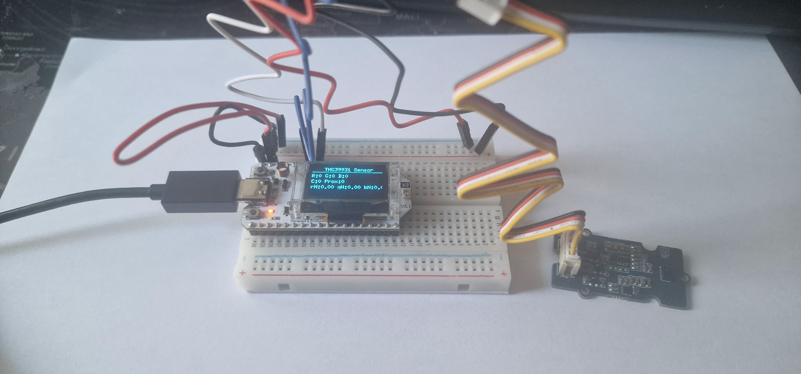

# 🌈 2-Light_Gest_Col_Prox – Capteur TMG39931 (Couleur, Lumière, Proximité)

Ce montage exploite le capteur **TMG39931** pour mesurer la **proximité**, la **lumière ambiante** et les **couleurs RVB** via l’interface **I2C**, à l’aide d’une **carte Heltec WiFi LoRa 32 V3**. Les données sont affichées en temps réel sur un écran **OLED 128x64** avec la bibliothèque **U8g2**, sans dépendre de bibliothèques Adafruit.

---

## 📷 Image du montage



---

## 🛠️ Matériel utilisé

| Élément             | Détails                        |
|---------------------|--------------------------------|
| **Microcontrôleur** | Heltec WiFi LoRa 32 V3         |
| **Capteur**         | TMG39931 (AMS/OSRAM)           |
| **Afficheur**       | OLED 128x64 (SSD1306 I2C)      |
| **Interface**       | I2C                            |

| Signal TMG39931 | Broche Heltec (J3) | GPIO |
|------------------|--------------------|------|
| SDA              | Pin 8              | 41   |
| SCL              | Pin 7              | 42   |

| Signal OLED  | GPIO Heltec par défaut |
|--------------|------------------------|
| SDA          | GPIO17                 |
| SCL          | GPIO18                 |
| RST          | GPIO21                 |

---

## 📚 Bibliothèques utilisées

| Bibliothèque    | Utilisation             |
|------------------|-------------------------|
| `Wire.h`         | Communication I2C       |
| `U8g2lib.h`      | Affichage OLED (U8g2)   |

---

## ⚙️ Fonctionnement

Le programme :

1. Initialise le bus **I2C** sur **GPIO41/SDA** et **GPIO42/SCL** pour le capteur.
2. Initialise l’écran OLED via U8g2 (I2C logiciel sur GPIO17/18).
3. Vérifie la présence du capteur à l’adresse **`0x39`**.
4. Configure manuellement les registres du TMG39931 :
   - Temps d’intégration
   - Gain
   - Activation des modes Proximité & Couleur
5. Lit et affiche :
   - **Proximité**
   - **Composantes RVB**
   - **Canal Clear (C)**
   - **Flux lumineux estimé**
   - **Valeurs RVB normalisées**
6. Affiche les données sur l’écran OLED **et** dans le moniteur série.
7. Commandes série disponibles :
   - `p` : Pause / Reprise des mesures
   - `r` : Redémarrage de l’ESP32

---

## 🧪 Paramètres mesurés

| Mesure         | Description                                |
|----------------|--------------------------------------------|
| **Proximité**   | Valeur brute 8 bits                        |
| **Rouge, Vert, Bleu** | Intensité de chaque composante couleur |
| **Clear (C)**   | Intensité lumineuse globale                |
| **Flux lumineux** | Approximation simple en pondérant RVB    |
| **RVB Normalisés** | Chaque canal rapporté à la somme totale |

---

## 🔍 Adresse I2C

Le TMG39931 est fixé à l’adresse **`0x39`**, sans option de modification.

---

## 📁 Fichiers inclus

- [`TMG39931.ino`](./TMG39931.ino) – Code complet en C++ (Arduino)
- [`TMG39931.jpg`](./TMG39931.jpg) – Capture écran OLED avec les mesures

---

## 💬 Exemple de sortie console

```plaintext
------ New Measurements ------
Proximity: 142
Color values:
Red: 523
Green: 688
Blue: 312
Clear: 1120
Luminous Flux: 541.7
Normalized RGB: (0.345, 0.454, 0.201)
```

---

## 🧠 Remarques

- Le capteur offre aussi des fonctions de **gestes**, non activées ici.
- La **normalisation RGB** permet d’avoir une estimation de teinte indépendante de la luminosité.
- Le **flux lumineux** est approximatif ; pour une photométrie précise, il faut étalonner le capteur.

---

## 🖼️ Détails sur la bibliothèque `U8g2lib.h`

La bibliothèque **U8g2** est une solution puissante, complète et autonome pour gérer les écrans graphiques monochromes (comme les OLED SSD1306) sur plateformes Arduino et dérivées. Elle se distingue par sa **compatibilité étendue**, son **affichage haute qualité**, et une **gestion optimisée de la mémoire** – idéale pour les environnements embarqués à ressources limitées.

---

### 🔧 Pourquoi U8g2 ?

- ✅ **Pas de dépendance à Adafruit_GFX** (contrairement à beaucoup d’autres bibliothèques OLED)
- ✅ **Compatibilité avec des affichages I2C, SPI, parallèles**
- ✅ **Supporte les polices vectorielles (proportions, tailles, styles)**
- ✅ **Écriture de texte optimisée et fonctionnelle même en mode tampon partiel**
- ✅ **Performance maîtrisée**, avec des options pour équilibrer RAM/CPU/vitesse

---

### ⚙️ Modes de fonctionnement

U8g2 propose **plusieurs modes de rendu** :

| Mode            | Description                                             | Usage conseillé                    |
|------------------|---------------------------------------------------------|-------------------------------------|
| `full buffer`   | Toute l’image est stockée en RAM avant affichage        | Meilleure qualité, nécessite ~1KB  |
| `page buffer`   | Affichage par pages (ex : 8 lignes à la fois)           | Moins de RAM, plus lent            |
| `U8x8`          | Texte uniquement, sans tampon graphique                 | Ultra rapide, très économe         |

Dans ce projet, le mode **`full buffer`** est utilisé pour afficher à la fois du texte et de petites formes (lignes, séparateurs) avec fluidité et précision.

---

### 🧩 Initialisation dans ce projet

```cpp
#include <U8g2lib.h>

// I2C logiciel (bit-bang) sur GPIO17 (SDA), GPIO18 (SCL)
U8G2_SSD1306_128X64_NONAME_F_SW_I2C u8g2(
  U8G2_R0,     // Rotation normale
  /* clock=*/ 18, 
  /* data=*/ 17, 
  /* reset=*/ 21 // Broche RST dédiée
);
```

🧠 À noter : L’utilisation du **mode logiciel (SW_I2C)** permet de libérer les broches I2C matérielles (GPIO41/42) pour le capteur TMG39931, évitant tout conflit.

---

### ✍️ Affichage dans la boucle

L'affichage est rafraîchi comme suit :

```cpp
u8g2.clearBuffer(); // Efface le tampon RAM
u8g2.setFont(u8g2_font_6x10_tf); // Police compacte et lisible
u8g2.drawStr(0, 10, "Proximity: 142");
u8g2.drawStr(0, 22, "Red: 523");
...
u8g2.sendBuffer(); // Transfère vers l'écran
```

Ce mécanisme permet d’avoir un **affichage stable, sans scintillement**, tout en gardant le contrôle total sur la mise en page.

---

### 📏 Performances et limitations

| Aspect             | Évaluation                     |
|--------------------|--------------------------------|
| **Qualité texte**  | Excellente (plusieurs polices) |
| **Vitesse**        | Moyenne (due au bit-bang I2C)  |
| **Mémoire RAM**    | ~1KB en mode full buffer       |
| **Compatibilité**  | Très large (plus de 100 écrans)|
| **Graphismes**     | Formes simples, sans images    |

Pour les projets nécessitant **des rendus graphiques précis avec peu de RAM**, U8g2 est souvent la meilleure option, bien plus sobre qu’Adafruit_GFX.

---

### 🧠 Bonnes pratiques

- Choisir une **police compacte** (ex : `u8g2_font_6x10_tf`) pour afficher plus d’informations sur l’écran 128x64.
- Regrouper les appels `drawStr()` avant un seul `sendBuffer()` pour optimiser les performances.
- Utiliser le **mode page buffer** si votre microcontrôleur a peu de RAM libre.
- Si seul du texte est affiché, le mode `U8x8` peut accélérer fortement l’affichage (sans buffer RAM graphique).

---

### 🔗 Ressources utiles

- [Documentation officielle U8g2](https://github.com/olikraus/u8g2/wiki)
- [Liste des polices U8g2](https://github.com/olikraus/u8g2/wiki/fntlistall)
- [Références des fonctions](https://github.com/olikraus/u8g2/wiki/u8g2reference)

---
