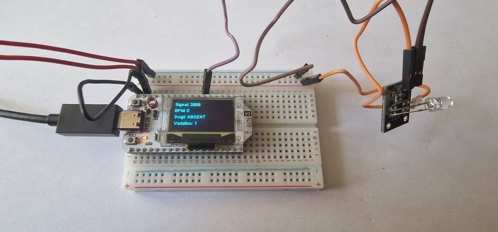

# ❤️ HBS – Détection de pouls avec capteur analogique et écran OLED

Ce montage utilise un **capteur de pouls** basé sur un **capteur analogique** pour détecter le rythme cardiaque et afficher en temps réel les mesures sur un **écran OLED 128x64**. Le capteur est connecté à une **carte Heltec WiFi LoRa 32 V3**, et les données sont affichées sur un écran OLED utilisant la bibliothèque **SSD1306Wire**.

---

## 📷 Image du montage



---

## 🛠️ Matériel utilisé

| Élément             | Détails                        |
|---------------------|--------------------------------|
| **Microcontrôleur** | Heltec WiFi LoRa 32 V3         |
| **Capteur**         | Capteur analogique de pouls    |
| **Afficheur**       | OLED 128x64 (SSD1306 I2C)      |
| **Interface**       | I2C                            |

| Signal Capteur     | Broche Heltec (J3) | GPIO |
|--------------------|--------------------|------|
| PULSE_PIN          | Pin 1              | 1    |

| Signal OLED  | GPIO Heltec par défaut |
|--------------|------------------------|
| SDA          | GPIO17                 |
| SCL          | GPIO18                 |
| RST          | GPIO21                 |

---

## 📚 Bibliothèques utilisées

| Bibliothèque       | Utilisation                   |
|--------------------|-------------------------------|
| `Wire.h`           | Communication I2C             |
| `HT_SSD1306Wire.h` | Affichage OLED (SSD1306 I2C)   |

---

## ⚙️ Fonctionnement

Le programme :

1. Initialise le bus **I2C** pour communiquer avec l'écran OLED.
2. Initialise le capteur de pouls sur **GPIO1** (entrée analogique).
3. Calibre le capteur de pouls pour obtenir une valeur de référence.
4. Lit les valeurs du capteur à intervalles réguliers et applique un **filtre moyenne mobile** pour stabiliser les lectures.
5. Détecte le **battement cardiaque** en détectant les variations du signal analogique et calcule le **battement par minute (BPM)**.
6. Affiche les informations suivantes sur l'écran OLED :
   - Valeur brute du capteur
   - BPM (battements par minute)
   - Détection du doigt (présent/absent)
   - Variation du signal
   - Courbe du signal du capteur
7. Affiche les données également dans le moniteur série pour le débogage et les graphiques.

---

## 🧪 Paramètres mesurés

| Mesure           | Description                                      |
|------------------|--------------------------------------------------|
| **Signal brut**  | Valeur brute lue par le capteur de pouls         |
| **BPM**          | Rythme cardiaque calculé en battements par minute|
| **Doigt**        | Détection de la présence du doigt (vrai ou faux) |
| **Variation**    | Variation du signal par rapport à la valeur de référence |

---

## 🔍 Détails du capteur

Le capteur de pouls est connecté à **GPIO1** (Pin 1 sur la carte Heltec). Il fournit une lecture analogique représentant l’intensité de la lumière réfléchie par les artères lors des battements cardiaques. La détection des variations de ce signal permet de calculer le rythme cardiaque.

---

## 📁 Fichiers inclus

- [`hbs.ino`](./hbs.ino) – Code complet en C++ (Arduino)
- [`hbs.jpg`](./hbs.jpg) – Capture écran OLED avec les mesures

---

## 💬 Exemple de sortie console

```plaintext
Signal: 512 | BPM: 72 | Doigt: PRÉSENT | Variation: 24
Signal: 530 | BPM: 72 | Doigt: PRÉSENT | Variation: 18
Signal: 520 | BPM: 72 | Doigt: PRÉSENT | Variation: 10
```

---

## 🧠 Remarques

- La détection du **battement cardiaque** est effectuée en mesurant les pics et les creux du signal analogique.
- Le **filtre moyenne mobile** améliore la stabilité du signal pour éviter les faux positifs.
- La **détection du doigt** est activée si la variation du signal dépasse un seuil déterminé expérimentalement.
- Le **calcul du BPM** est basé sur l'intervalle entre les pics du signal, et il est mis à jour à chaque battement détecté.

---

## 🖼️ Détails sur la bibliothèque `HT_SSD1306Wire.h`

La bibliothèque **SSD1306Wire** permet d’interfacer facilement des écrans OLED 128x64 via I2C sur les cartes Arduino. Elle simplifie l’affichage de texte, de formes et de graphiques tout en optimisant l’utilisation de la mémoire, idéale pour les environnements à ressources limitées.

---

### 🔧 Pourquoi SSD1306Wire ?

- ✅ **Compatibilité avec les écrans OLED SSD1306 via I2C**
- ✅ **Affichage fluide de texte et de graphiques**
- ✅ **Économie de mémoire grâce à l’utilisation d’I2C**
- ✅ **Supporte des fonctionnalités avancées comme la gestion des polices et des formes géométriques**

---

### ⚙️ Initialisation dans ce projet

```cpp
#include "HT_SSD1306Wire.h"

// Initialisation de l'écran OLED
static SSD1306Wire display(0x3c, 500000, SDA_OLED, SCL_OLED, GEOMETRY_128_64, RST_OLED);
```

---

### ✍️ Affichage dans la boucle

L'affichage est rafraîchi à chaque cycle de la boucle avec les données du capteur :

```cpp
display.clear();
display.setTextAlignment(TEXT_ALIGN_LEFT);
display.setFont(ArialMT_Plain_10);
display.drawString(0, 0, "Signal: " + String(sensorValue));
display.drawString(0, 15, "BPM: " + String(BPM));
display.drawString(0, 30, "Doigt: " + String(fingerDetected ? "PRÉSENT" : "ABSENT"));
display.drawString(0, 45, "Variation: " + String(variation));
```

---

### 📏 Performances et limitations

| Aspect             | Évaluation                     |
|--------------------|--------------------------------|
| **Qualité texte**  | Bonne (police lisible)         |
| **Vitesse**        | Moyenne (dépend de la fréquence de lecture) |
| **Mémoire RAM**    | Faible (~2-3 KB)               |
| **Compatibilité**  | Large (fonctionne avec de nombreux écrans SSD1306) |
| **Graphismes**     | Simple, courbes et texte       |

Pour les projets nécessitant des graphiques simples et un affichage fluide, **SSD1306Wire** est un excellent choix pour gérer un écran OLED avec un minimum de consommation mémoire.

---

### 🧠 Bonnes pratiques

- Utiliser un **filtrage de signal** pour réduire les fluctuations rapides qui peuvent être interprétées à tort comme des battements cardiaques.
- Afficher les valeurs de manière **dynamique** sur l'écran pour une expérience utilisateur fluide.
- En cas de **problème de stabilité** du signal, ajuster les paramètres de calibration ou le seuil de détection du doigt.

---

### 🔗 Ressources utiles

- [Documentation de la bibliothèque SSD1306Wire](https://github.com/ThingPulse/esp8266-oled-ssd1306)
