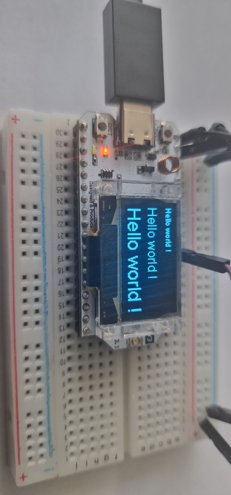

# 🖥️ Affichage OLED – Affichage Texte avec différentes tailles sur écran SSD1306

Ce projet utilise un écran **OLED 128x64** basé sur le contrôleur **SSD1306** pour afficher trois messages "Hello World" à différentes tailles de police. Il est alimenté par un microcontrôleur compatible, avec l'utilisation de la bibliothèque **HT_SSD1306Wire** pour gérer l'écran via l'interface **I2C**.

---

## 📷 Image du module



---

## 🛠️ Matériel utilisé

| Élément             | Détails                           |
|---------------------|-----------------------------------|
| **Microcontrôleur** | Compatible avec I2C (par exemple ESP32, Arduino) |
| **Afficheur**       | OLED 128x64 (SSD1306 I2C)         |
| **Interface**       | I2C                               |

| Signal OLED  | GPIO Microcontrôleur (Exemple ESP32) |
|--------------|--------------------------------------|
| SDA          | GPIO17 (ESP32)                      |
| SCL          | GPIO18 (ESP32)                      |
| RST          | GPIO21 (ESP32)                      |

---

## 📚 Bibliothèques utilisées

| Bibliothèque        | Utilisation                         |
|---------------------|-------------------------------------|
| `Wire.h`            | Communication I2C                   |
| `HT_SSD1306Wire.h`  | Affichage sur écran OLED SSD1306    |

### 📖 Détails sur les bibliothèques

#### `Wire.h`  

La bibliothèque **Wire** est utilisée pour la communication I2C, qui permet à l'Arduino ou au microcontrôleur de communiquer avec des périphériques I2C comme l'écran OLED SSD1306. Elle est essentielle pour configurer la communication entre le microcontrôleur et l'écran via les broches SDA et SCL.

#### `HT_SSD1306Wire.h`  

Cette bibliothèque est une implémentation spécifique pour les écrans OLED utilisant le contrôleur **SSD1306** avec la communication **I2C**. Elle est souvent utilisée pour les écrans OLED de petite taille, tels que le **128x64**. Elle offre des fonctionnalités de base pour initialiser l'écran, afficher du texte, des formes simples, et gérer l'affichage sans trop de complexité.

---

## ⚙️ Fonctionnement

Le programme :

1. Initialise la communication série pour faciliter le débogage.
2. Active l'alimentation du module OLED (spécifique à certaines cartes).
3. Initialise l'écran OLED via la bibliothèque **HT_SSD1306Wire** en utilisant l'interface I2C.
4. Efface l'écran pour un affichage propre avant chaque mise à jour.
5. Affiche trois messages "Hello World" à trois tailles différentes : **petite**, **moyenne** et **grande**.
6. Rafraîchit l'écran toutes les **5 secondes** avec le message mis à jour.

---

## 📁 Fichiers inclus

- [`hw.ino`](./hw.ino) – Code complet en C++ (Arduino)
- [`hw.jpg`](./hw.jpg) – Image du module OLED utilisé dans le projet

---

## 💬 Exemple de sortie écran

L'écran affichera successivement :

```markdown
Hello world !    (petite taille)
Hello world !    (taille moyenne)
Hello world !    (grande taille)
```

Ces messages seront visibles pendant 5 secondes avant de recommencer l'affichage.

---

## 🧠 Remarques

- Ce projet est un **exemple simple** pour montrer l'affichage de texte à différentes tailles sur un écran OLED. Il peut être utilisé comme point de départ pour des projets plus complexes, comme des affichages de données en temps réel, des graphismes, etc.
- L'option **d'alimentation du module OLED (Vext)** peut ne pas être nécessaire sur toutes les cartes. Elle est activée ici par sécurité pour certaines configurations spécifiques.

---

## 🧩 Initialisation dans ce projet

```cpp
#include <Wire.h>
#include "HT_SSD1306Wire.h"

// Configuration de l'écran OLED
static SSD1306Wire display(0x3c, 500000, SDA_OLED, SCL_OLED, GEOMETRY_128_64, RST_OLED);

void setup()
{
  // Initialisation de la communication série (optionnel, mais utile pour le débogage)
  Serial.begin(115200);

  // Active l'alimentation du module Vext (spécifique à certaines cartes)
  pinMode(Vext, OUTPUT);
  digitalWrite(Vext, LOW);

  // Délai court pour stabilisation
  delay(100);

  // Initialise l'écran OLED
  display.init();

  // Prépare l'écran pour l'affichage
  display.clear();
}

void loop()
{
  // Efface l'écran avant de dessiner
  display.clear();

  // Définit l'alignement du texte à gauche
  display.setTextAlignment(TEXT_ALIGN_LEFT);

  // Premier Hello World en petite taille (10)
  display.setFont(ArialMT_Plain_10);
  display.drawString(0, 0, "Hello world !");

  // Deuxième Hello World en taille moyenne (16)
  display.setFont(ArialMT_Plain_16);
  display.drawString(0, 20, "Hello world !");

  // Troisième Hello World en grande taille (24)
  display.setFont(ArialMT_Plain_24);
  display.drawString(0, 40, "Hello world !");

  // Affiche le contenu sur l'écran
  display.display();

  // Attend 5 secondes avant de recommencer
  delay(5000);
}
```

---

### 🔧 Affichage sur l'écran

L'affichage sur l'écran est effectué par la commande suivante, qui est appelée après chaque mise à jour de l'écran :

```cpp
display.display();
```

Cela garantit que le texte et autres éléments graphiques sont réellement envoyés à l'écran après avoir été dessinés dans le tampon.

---

### 📏 Performances et limitations

| Aspect             | Évaluation                         |
|--------------------|------------------------------------|
| **Qualité texte**  | Excellente (avec des polices définies par la bibliothèque) |
| **Vitesse**        | Moyenne (mise à jour de l'écran toutes les 5 secondes)  |
| **Mémoire RAM**    | Faible (le texte et le graphique prennent très peu de mémoire) |
| **Compatibilité**  | Large (fonctionne sur de nombreux microcontrôleurs compatibles I2C) |

Ce projet est simple et léger, adapté aux projets avec des ressources limitées en mémoire.

---

### 🧠 Bonnes pratiques

- Utiliser des **polices compactes** pour maximiser l'espace d'affichage.
- Optimiser la fréquence de mise à jour de l'écran pour éviter de surcharger le microcontrôleur.
- Utiliser un **affichage propre (clear)** avant chaque rafraîchissement pour éviter les résidus d'anciens affichages.

---

### 🔗 Ressources utiles

- [Documentation SSD1306](https://github.com/greiman/SSD1306)
- [Exemples d'utilisation de l'écran OLED SSD1306](https://www.arduino.cc/en/Tutorial/LibraryExamples)

---
